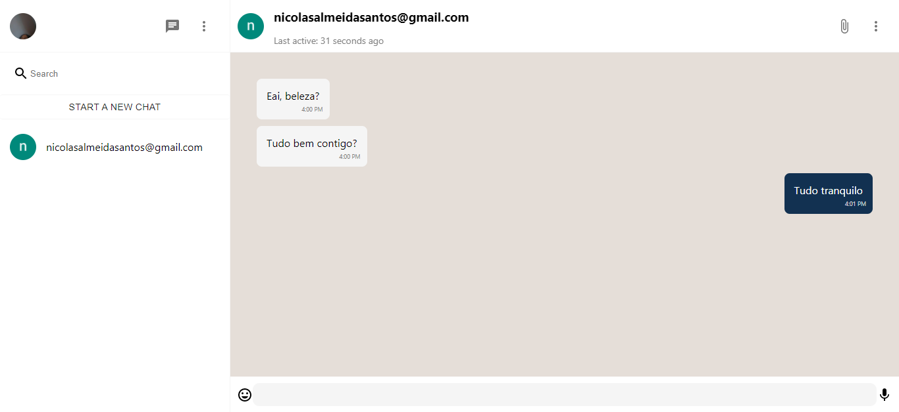

# Chatty

  


  



  

> Faça login com sua conta Gmail, adicione chats e converse ao vivo com outros usuários.

### Techs
A aplicação foi feita utilizando Nextjs com as páginas do chat sendo geradas através do *Server Side Rendering*. A estilização foi feita utilizando Styled-Components e Material-UI. Para os serviços de autenticação e manipulação de dados, foi utilizado os recursos do Firebase.

  <br/>

### Produção

Você pode acessar e utilizar a última versão do Chatty em produção clicando [aqui](https://chatty-me.vercel.app/)
<br/>
### Ajustes e melhorias

A base do projeto está pronta, mas ainda há melhorias à serem adicionadas como:

  

- [x] Responsividade mobile

- [x] Tema dark

- [ ] OAuth com outros provedores, como Facebook

- [ ] Troca de tela de fundo do chat

- [ ] Envio de imagens

  <br/>

## 🚀 Instalando o Chatty

  

Para instalar o Chatty, siga estas etapas:

  

```

npm install

  

ou

  

yarn install

```
<br/>
  

## ☕ Usando Chatty

  

Para executar o *Chatty* em desenvolvimento , siga estas etapas:

  

```

npm run dev

  

ou

  

yarn dev

```

Para acesso aos recursos do firebase, é preciso criar um projeto no console do Firebase e adicionar seus dados de conexão ao arquivo de variáveis locais


  

[⬆ Voltar ao topo](#Chatty)<br>

<br>
<br>
<br>

  ***made with :purple_heart: by [@NickSant](https://github.com/NickSant)***


